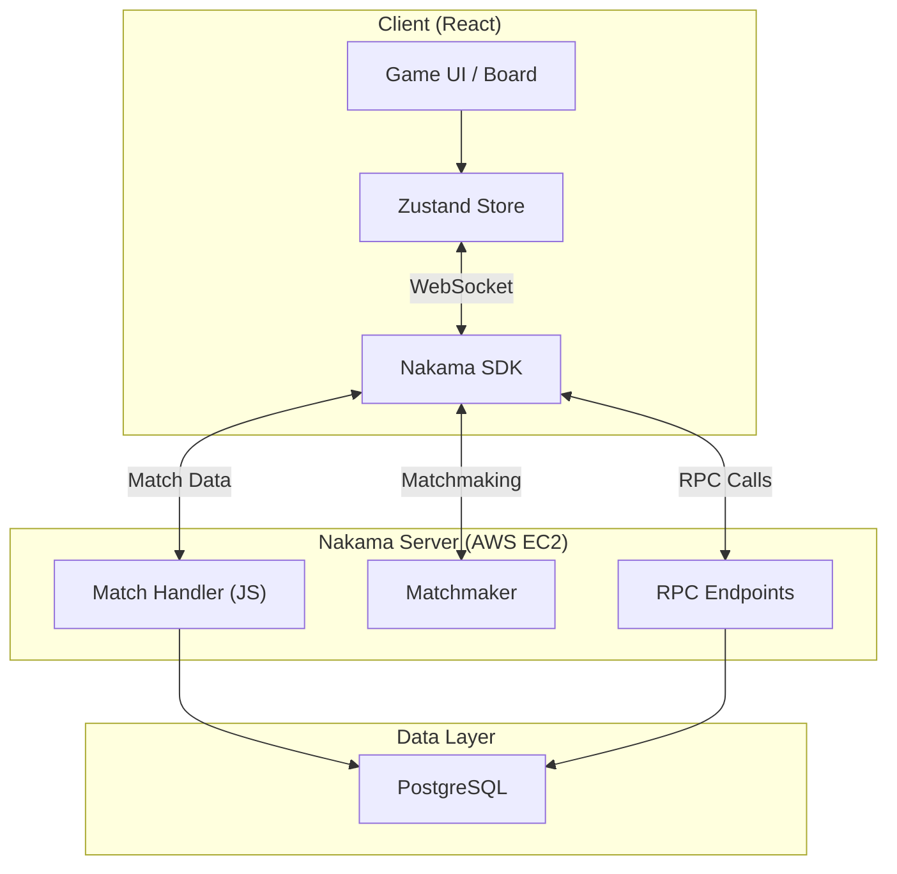
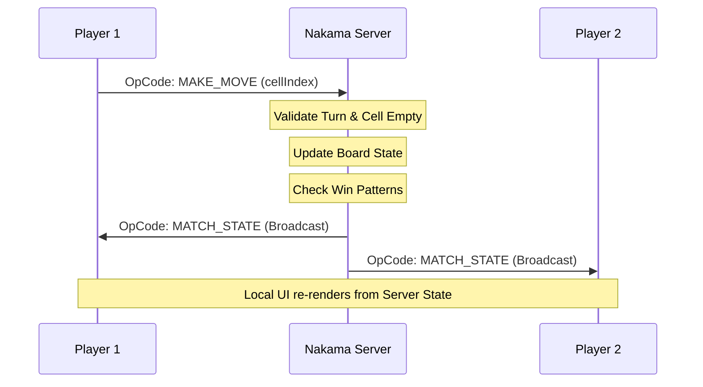

<div align="center">

# ❌ Multiplayer Tic-Tac-Toe ⭕

### Server-authoritative. Real-time. Unbeatable fairness.

A high-performance multiplayer Tic-Tac-Toe game where every move is validated by a Nakama backend. No client-side cheating, just pure skill and strategy delivered via sub-200ms WebSocket sync.


[Features](#-features) · [Tech Stack](#-tech-stack) · [Quick Start](#-quick-start) · [Architecture](#-architecture) · [API](#-api-reference)

</div>

---

## 🎯 What is this?

This is a **production-ready multiplayer game** built to demonstrate the power of server-authoritative architecture using Nakama. Unlike traditional web games, the client is "dumb"—it only renders what the server dictates. Every click is a request, and every win is verified by the source of truth.

**Perfect for:**
- 🎮 **Competitive Play** — Global leaderboard with persistent scoring (+10 Win, +3 Draw)
- ⏱️ **Fast Paced** — 30-second turn timers with automatic forfeit on timeout
- 📱 **Cross-Platform** — Fully responsive Tailwind UI for desktop and mobile play
- 🛠️ **Dev Template** — A clean baseline for building complex Nakama-based multiplayer titles

---

## ✨ Features

<table>
<tr>
<td width="50%">

### 🛡️ Server-Authoritative Logic
The server manages the board state, validates turn order, and detects win/draw conditions. Clients cannot spoof moves or claim false victories.

### 🏆 Global Leaderboard
Integrated persistent ranking system. Players earn points for every match, with top standings available via a dedicated leaderboard screen.

### ⏱️ Authority Turn Timers
30-second countdowns enforced by the server. Features a sleek SVG ring UI that transitions from Amber to Red as time expires.

### ⚡ Seamless Matchmaking
One-click "Find Match" button utilizes Nakama's matchmaker to pair you with available opponents instantly.

</td>
<td width="50%">

### 🔄 State Recovery
Resilient WebSocket bindings. Refreshing the page or switching tabs preserves your match session and symbol assignment (X/O).

### 🎨 Premium Aesthetics
Modern dark-mode UI with smooth CSS transitions, interactive hover states, and professional typography.

### 🔐 Secure Sessions
Uses randomized UUID device authentication and sessionStorage to prevent multi-tab conflicts during local development.

### 📢 Real-Time Toast Alerts
Instant feedback for invalid moves, opponent disconnections, and match outcomes via React-Toastify.

</td>
</tr>
</table>

---

## 🛠️ Tech Stack

<table>
<tr>
<td align="center" width="33%"><b>Frontend</b></td>
<td align="center" width="33%"><b>Backend</b></td>
<td align="center" width="33%"><b>Infrastructure</b></td>
</tr>
<tr>
<td>

- React 18 (Vite)
- Zustand (State)
- Tailwind CSS
- Nakama JS SDK
- Lucide Icons

</td>
<td>

- Nakama Server 3.21
- JavaScript Runtime
- PostgreSQL 14
- rpc_create_match
- Match Handler API

</td>
<td>

- Docker + Compose
- AWS EC2 (Production)
- Vercel (Frontend)
- Environment Variables
- GitHub Actions

</td>
</tr>
</table>

---

## 🏗️ Architecture

### System Overview



### Server-Authoritative Gameplay Flow



---

## 🚀 Quick Start

### 1. Run Backend (Docker)

```bash
cd backend
cp .env.example .env    # Set POSTGRES_PASSWORD
docker compose up -d
```

### 2. Run Frontend

```bash
cd frontend
cp .env.example .env    # Point VITE_NAKAMA_HOST to 127.0.0.1
npm install
npm run dev
```

Open **http://localhost:5173**, enter a username, and start playing! 🏁

---

## 🔑 Environment Variables

### Backend (`/backend/.env`)
```env
POSTGRES_PASSWORD=your_password
CONSOLE_USERNAME=your_username
CONSOLE_PASSWORD=your_password
```

### Frontend (`/frontend/.env`)
```env
VITE_NAKAMA_SERVER_KEY=your_secret_key
VITE_NAKAMA_HOST=127.0.0.1
VITE_NAKAMA_PORT=3000
VITE_NAKAMA_USE_SSL=false
```

---

## 🌐 Deploy

| Guide | Stack | Target |
|-------|-------|------|
| [**README.md (Backend)**](#backend-aws-ec2) | AWS EC2 + Docker | API / WebSockets |
| [**README.md (Frontend)**](#frontend-vercel) | Vercel | Web Application |

### Backend (AWS EC2)
1. Transfer the `backend/` folder to your instance.
2. Run `docker-compose up -d`.
3. Open ports `7350` (API) and `7351` (Console) in AWS Security Groups.

### Frontend (Vercel)
1. Connect your repository.
2. Set `VITE_NAKAMA_HOST` to your EC2 Public IP.
3. Deploy!

---

## 📡 API Reference

<details>
<summary><b>RPC Endpoints</b> — match creation & leaderboard</summary>

| Method | Endpoint | Description |
|--------|----------|-------------|
| `RPC` | `rpc_create_match` | Finds an open match or creates a new authoritative match. |
| `RPC` | `rpc_get_leaderboard` | Fetches the top 10 players by score (Wins +10, Draws +3). |
</details>

<details>
<summary><b>OpCodes</b> — WebSocket communication</summary>

| Code | Name | Direction | Description |
|------|------|-----------|-------------|
| `1` | `MAKE_MOVE` | Client → Server | Sends `cellIndex` to the server. |
| `2` | `MATCH_STATE` | Server → Client | Broadcasts updated board and turn. |
| `3` | `MOVE_REJECT` | Server → Client | Notifies client of an invalid move attempt. |
| `4` | `GAME_OVER` | Server → Client | Final result, winner ID, and reason. |
</details>

---

## 📁 Project Structure

```
multiplayer-tic-tac-toe/
├── backend/
│   ├── nakama/data/modules/  # JS Match Handler & RPCs
│   ├── docker-compose.yml    # Nakama + Postgres stack
│   └── .env                  # Backend credentials
└── frontend/
    ├── src/components/       # UI (Board, Timer, Leaderboard)
    ├── src/gameStore.js      # Zustand orchestration
    ├── src/nakamaClient.js   # SDK Service Layer
    └── tailwind.config.js    # Premium styling tokens
```

---

<div align="center">

## 📝 License

MIT — feel free to use this as a base for your own Nakama projects.

Built for the Nakama Community 🚀

</div>


